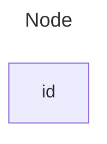
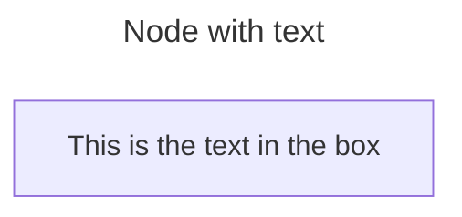
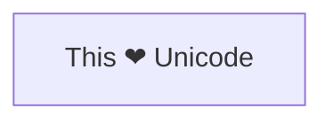
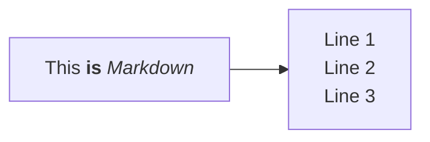
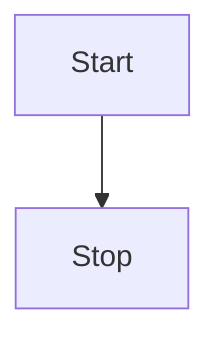
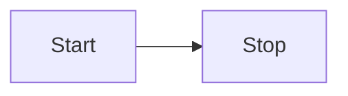
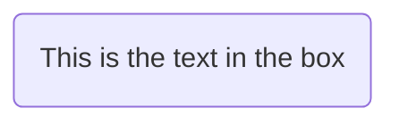
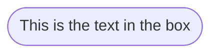
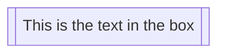
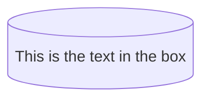

### NOTE
- Instead of `flowchart` one can also use `graph`.

#### A node (default)

#### A node with text

#### Unicode text
Use `"` to enclose the unicode text.

#### Markdown formatting
Use double quotes and backticks "` text `" to enclose the markdown text.

#### Direction
This statement declares the direction of the Flowchart.
Possible FlowChart orientations are:
- TB - Top to bottom
- TD - Top-down/ same as top to bottom
- BT - Bottom to top
- RL - Right to left
- LR - Left to right

#### Node shapes
- **round edges:** `()`
- 
1. A node with round edges

2. A stadium shaped node

3. A node in a subroutine shape

4. A node in a cylindrical shape

